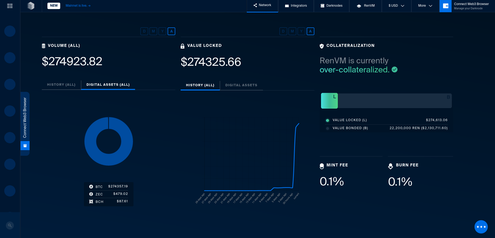

# `🎛️ Command Center`

* Mainnet: <https://mainnet.renproject.io>
* Testnet: <https://testnet.renproject.io>

The Command Center is a dashboard for seeing RenVM stats and for operating darknodes. It should be used along side the [Darknode CLI](https://github.com/renproject/darknode-cli).

For instructions on running a darknode, see <https://docs.renproject.io/darknodes>.

## Previews

Network stats



Darknode page


## Developer notes

### Project

The project is structured into [`components`](./src/components), [`store`](./src/store) and [`lib`](./src/lib).

The library (`lib`) files of note are:

* [`contractReads.ts`](./src/lib/ethereum/contractReads.ts)
* [`contractWrites.ts`](./src/lib/ethereum/contractWrites.ts)

### Running locally

After cloning, run:

```sh
yarn
yarn start
```

To configure the network or add an Infura key, create a `.env` file:

```sh
REACT_APP_INFURA_KEY="" # Optional
REACT_APP_NETWORK="mainnet" # Options are "testnet" (default) or "mainnet"
```

If you don't have an Infura key (Project ID), you should make sure to connect your Web3 wallet when the page is loaded. You may see some errors until the wallet is connected. A free Infura key can generated at [https://infura.io](https://infura.io/).

### Tests

(see [CircleCI config](./.circleci/config.yml) for more details)

In one terminal, start a local Ethereum node by running:

```bash
cd ./node_modules/darknode-sol
yarn install
(yarn ganache-cli -d  > /dev/null &)
sleep 5
yarn truffle migrate 
```

In another, run:

```bash
yarn run test
```
